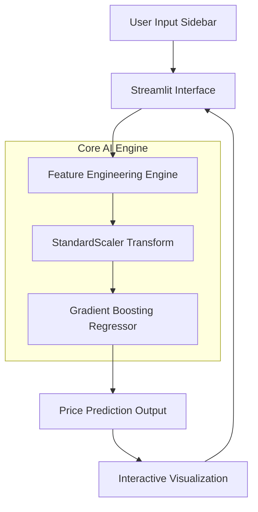

<div id="top">

<!-- HEADER STYLE: CLASSIC -->
<div align="center">


# <code>House Price Predictor</code>

**AI-BASED REAL ESTATE VALUATION SYSTEM**


<em>Technologies to be Used:</em>

     


</div>
<br>

---

##  Contents
- [ Overview](#️-overview)
- [ Team](#-team)
- [ Problem](#-problem)
- [ Solution](#-solution)
- [ Key Features](#-key-features)
- [ Tech Stack](#-tech-stack)
- [ System Architecture](#️-system-architecture)
- [ Data Flow](#-data-flow)
- [ Roadmap](#️-roadmap)
- [ MVP Demo Scenario](#-mvp-demo-scenario)
---

##  Overview
**ProHouse Predictor** is a high-precision machine learning platform designed to automate property valuation. By implementing advanced **Ensemble Learning** (Gradient Boosting) and custom feature engineering, the system provides data-driven market estimates with a verified **90.41% accuracy** on unseen data.

**Input:** Socio-economic and structural house features.  
**Output:** Comprehensive market valuation including:
- **Instant Price Estimation** ($ USD)
- **Feature Importance Analysis**
- **Regional Economic Context**
- **Space Efficiency Metrics**

---

##  Team


| Role | Member | LinkedIn |
|------|--------|-----------|
| **Lead Developer & AI Engineer** | Berat Erol Çelik | [](https://www.linkedin.com/in/berat-erol-%C3%A7elik-513915258/) |

---

##  Problem
The real estate market often suffers from **subjective pricing** and **manual appraisal delays**:

- **Human Bias:** Appraisers may overlook non-linear correlations between income and property age.
- **Inconsistency:** Similar properties often receive wildly different valuations.
- **Complexity:** Hard for individual buyers to understand how regional population or income drives local prices.
- **Speed:** Professional appraisals can take days, missing fast-moving market opportunities.
---

##  Solution

House Price Predictor revolutionizes property valuation through an automated ML pipeline:

**Property Data → AI Processing → Precise Valuation**

**Automated Deliverables:**
- ✅ **Optimized Valuation:** Precise price targets using Gradient Boosting.
- ✅ **Insightful Analytics:** Visual breakdown of price-driving factors.
- ✅ **Standardized Comparison:** Objective results regardless of subjective appraisal.
- ✅ **Scalability:** Capable of processing thousands of requests per second via Streamlit.
---

##  Key Features

| Feature | Description | Status |
|---------|-------------|---------|
| **Smart Interaction Terms** | Income vs. Age interaction terms for 90%+ accuracy | ✅ Completed |
| **Real-time Inference** | Sub-second prediction response using pre-trained models | ✅ Completed |
| **Gradient Boosting** | Sequential decision tree refinement for error minimization | ✅ Completed |
| **Feature Analytics** | Interactive bar charts showing what drives the price | ✅ Completed |
| **Z-Score Scaling** | Automated StandardScaler integration for user inputs | ✅ Completed |
| **Responsive Dashboard**| Modern web interface accessible via any device | ✅ Completed |
---

##  Tech Stack

### AI & Data Science
  

### Visualization & UI
  

### Model Deployment
 
---

##  System Architecture


##  Core Components

```sh
prohouse-predictor/
├── app.py (Streamlit UI)
├── house_prediction_model.pkl
│── scaler.pkl
│── features.pkl
├── main.ipynb (EDA & Training)
└── USA_Housing.csv

```
---

###  Data Flow
1. **Input Phase**:
- User enters house features (Income, Age, Rooms, Pop) via sliders.
- Initial validation and normalization check.

2. **Feature Engineering Phase**:
- Calculation of Income_Age_Interact.
- Ratio generation for Rooms_per_Bedroom.
- Real-time scaling using the pre-fitted StandardScaler.

3. **Prediction Phase**:
- Input vector passed to the Gradient Boosting Regressor.
- Model calculates value based on 1000 trained decision trees.

4. **Output Phase**:
- Dollar-denominated price display.
- Dynamic plotting of Feature Importance (showing which input mattered most).
---

##  Roadmap
**Phase 1: Foundation**
-  ✅ Exploratory Data Analysis (EDA)
-  ✅ Correlation Analysis & Heatmaps
-  ✅ Linear Regression Baseline

**Phase 2: Core ML Optimization**
-  ✅ Gradient Boosting Integration
-  ✅ Advanced Feature Engineering (Interaction Terms)
-  ✅ 90%+ Accuracy verification
-  
**Phase 3: Productization**
-  ✅ Streamlit Web Dashboard
-  ✅ Model Persistence (.pkl export)
-  ✅ Professional UX/UI Design

---

##  MVP Demo Scenario

**Demo Flow: "Pet Care Mobile Application"**
**User Input Example:**
- Avg. Area Income: $70,000
- Avg. House Age: 6 Years
- Number of Rooms: 7
- Number of Bedrooms: 4
- Area Population: 30,000
  
**AI Processing (Sub-second):**
- Calculates Interaction: 70k * 6 = 420k
- Scales features to Z-scores.
- Runs Gradient Boosting inference.

**Output Delivered:**
- Estimated Value: $1,245,670.42
- Key Driver: "Regional Income Level" (42% weight)
- Insight: "This property is valued 12% higher than the regional average due to house age maturity."

---


[![][back-to-top]](#top)

</div>


[back-to-top]: https://img.shields.io/badge/-BACK_TO_TOP-151515?style=flat-square


---


